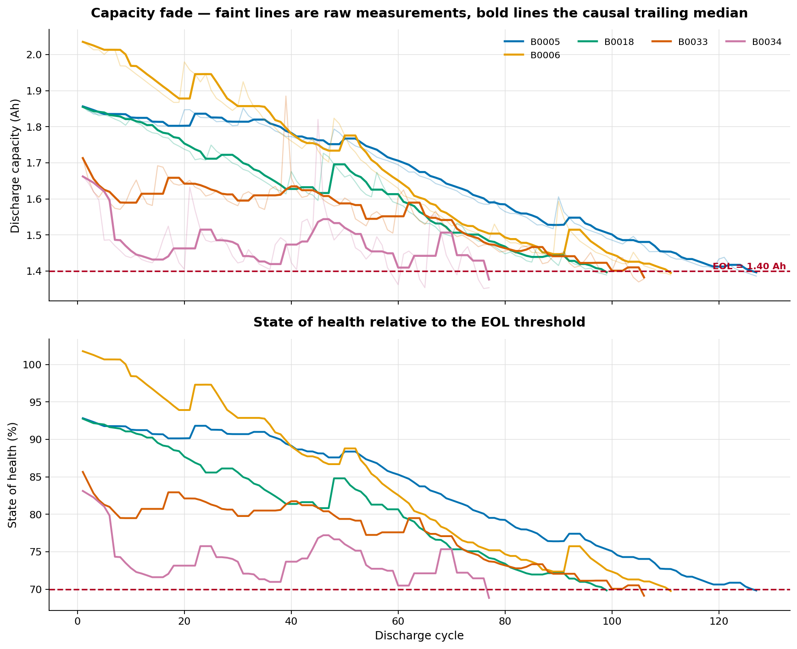
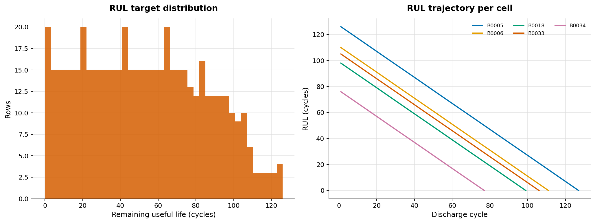
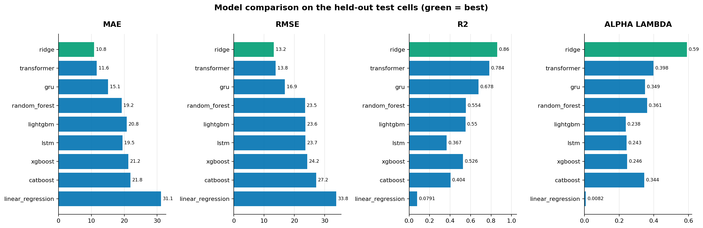
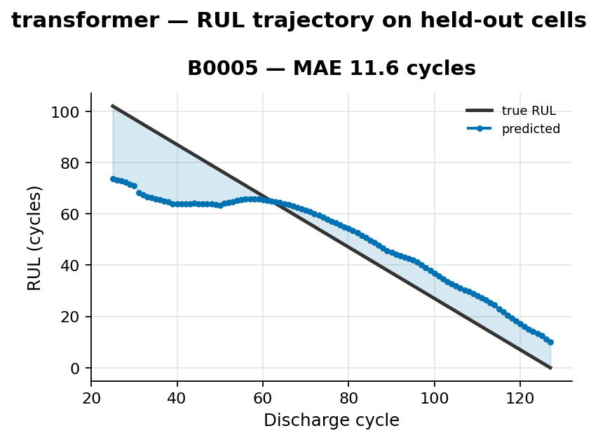
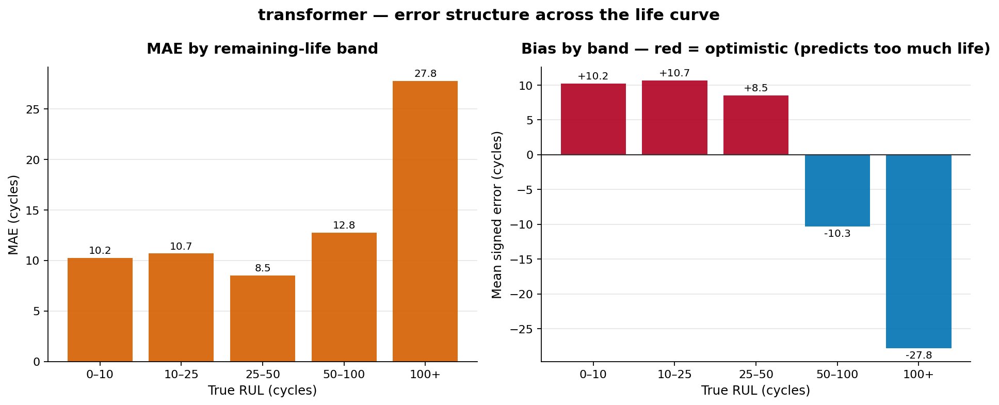
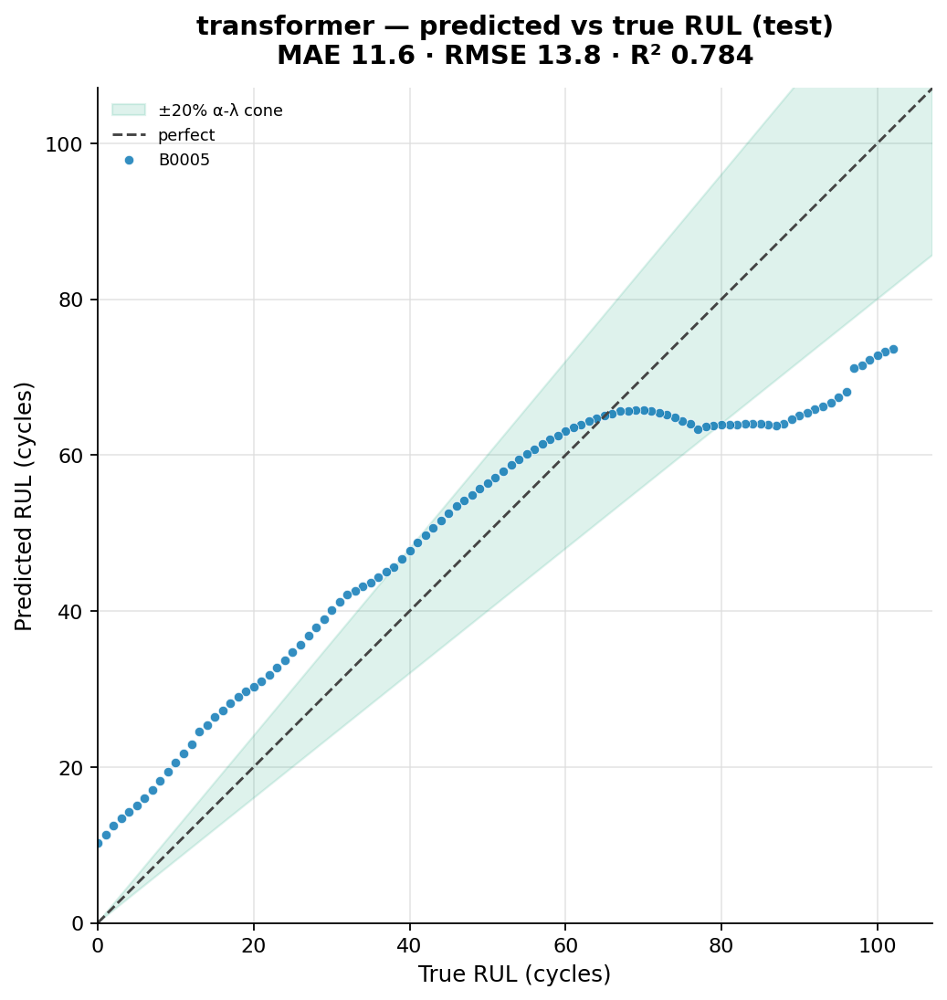
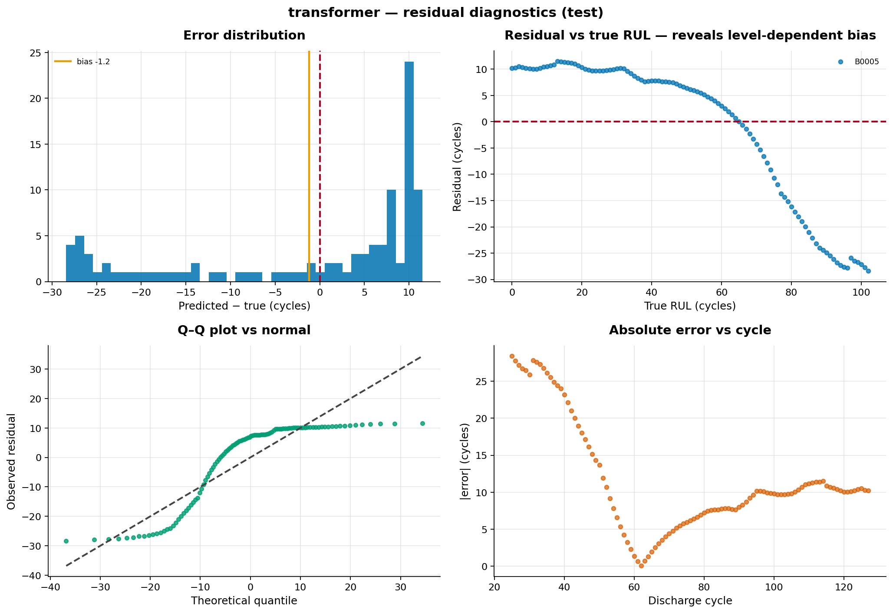
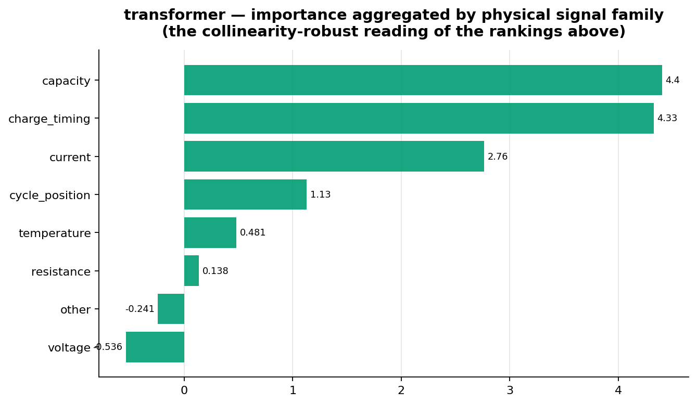
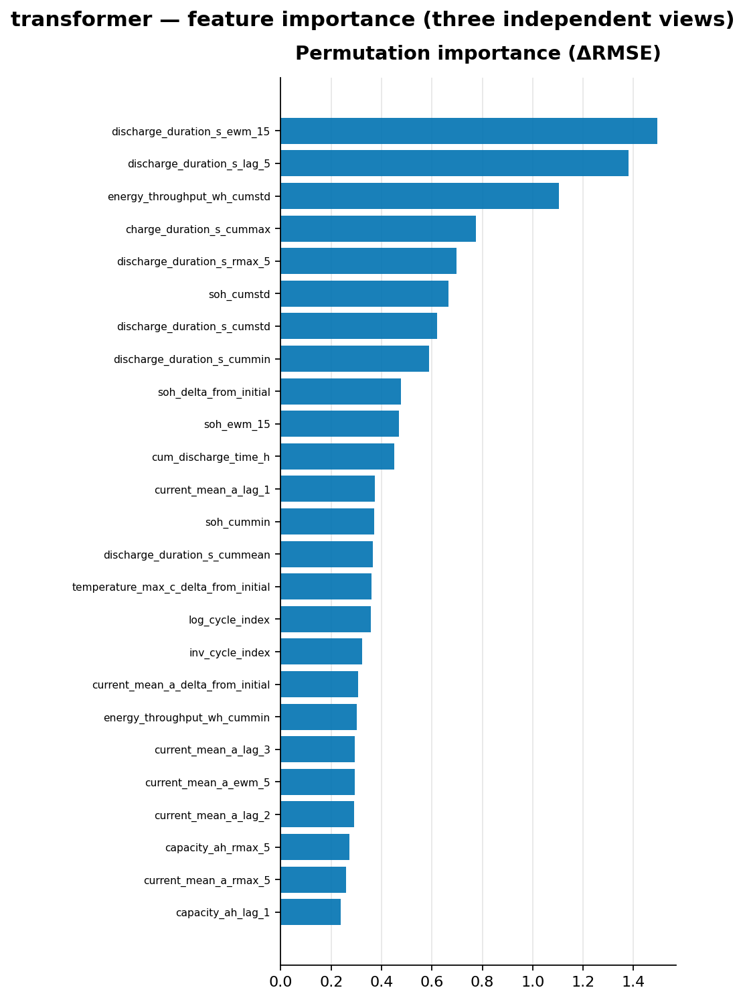

# Battery Digital Twin & Predictive Intelligence Platform

**Milestone 1 — Remaining Useful Life (RUL) prediction for lithium-ion cells.**

An end-to-end, production-style machine-learning pipeline that predicts how many
discharge cycles a lithium-ion battery has left before it reaches end of life,
built on the NASA Ames PCoE battery aging dataset.

```bash
pip install -e ".[dev]"
python scripts/download_data.py
python scripts/run_pipeline.py --config configs/default.yaml
```

---

## Contents

1. [Business problem](#1-business-problem)
2. [What this repository actually claims](#2-what-this-repository-actually-claims)
3. [Dataset](#3-dataset)
4. [Target definition](#4-target-definition)
5. [Pipeline](#5-pipeline)
6. [Preventing leakage](#6-preventing-leakage)
7. [Models](#7-models)
8. [Results](#8-results)
9. [Explainability](#9-explainability)
10. [Reproducing everything](#10-reproducing-everything)
11. [Repository structure](#11-repository-structure)
12. [Configuration](#12-configuration)
13. [Testing](#13-testing)
14. [Limitations](#14-limitations)
15. [Roadmap](#15-roadmap)

---

## 1. Business problem

A lithium-ion cell loses capacity every cycle. Below roughly 70–80 % of rated
capacity it is considered end-of-life for its primary application. Knowing *when*
a cell will get there, from data you already collect, is worth money and safety in
three places:

| Domain | The decision this informs |
|---|---|
| Electric vehicles | Warranty reserves, battery-health disclosure at resale, when to flag a pack for service |
| Grid storage | Replacement scheduling and capacity procurement across thousands of modules |
| Second-life resale | Whether a retired EV pack has enough life left to be worth refurbishing |
| Manufacturing QA | Catching a bad production lot from early-cycle behaviour |

Getting it wrong costs in both directions. Retire a cell too early and you throw
away usable capacity and create avoidable e-waste. Retire it too late and you run
a degraded cell past its safe operating window.

The question this milestone answers is deliberately the hard one:

> Given a battery cell we have **never seen before**, and its charge/discharge
> history so far, how many cycles remain before it drops below 70 % of rated
> capacity?

## 2. What this repository actually claims

The headline number is **leave-one-battery-out cross-validated**, not a single
split:

| | MAE | RMSE | R² |
|---|---|---|---|
| **Leave-one-battery-out (5 cells, 400 scored rows)** | **8.06** | **9.93** | **0.850** |
| Single battery-holdout (1 test cell) | 11.62 | 13.82 | 0.784 |

Errors are in **discharge cycles**. Per-fold MAE ranges 6.5 – 12.0 cycles
(σ = 2.34), and *that spread is the real uncertainty on the headline*, not the
bootstrap interval over rows.

Cross-validation is used because after the data-quality gates the cohort is five
cells — a single holdout would put **one** cell in test, and the metric would
swing on which cell was drawn. It demonstrably does: Ridge finishes **last on the
validation cell and first on the test cell** (see §8).

Random row-level splitting is not used anywhere. On this data it produces R²
above 0.99 and means nothing: consecutive cycles of one cell are near-duplicates,
so a random split lets a model interpolate between neighbouring rows instead of
forecasting.

`docs/limitations.md` is not an afterthought — read it before quoting a number.

## 3. Dataset

NASA Ames Prognostics Data Repository, "Battery Data Set" (Saha & Goebel, 2007):
34 commercial 2.0 Ah 18650 cells cycled to failure in a temperature chamber, with
interleaved electrochemical impedance sweeps.

The loader normalises the raw MATLAB structs into **one row per discharge cycle**,
enriched with summary statistics of that discharge, of the most recent preceding
charge, and of the most recent preceding impedance sweep. Nothing is ever
back-filled from a future step.

Of the 34 cells, **5** pass the cohort gates — too short, begins already
degraded, never degrades, right-censored, too few labelled cycles, or a
mid-experiment regime change. Every exclusion is mechanical and logged: the
config asks for *all* cells and the gates select the cohort deterministically.
Full accounting in **[`docs/dataset_card.md`](docs/dataset_card.md)**.



*The dataset in one figure.* Faint lines are raw capacity measurements, bold
lines the causal trailing median, the dashed line the 1.40 Ah end-of-life
threshold. Two things to notice: the raw traces are **not monotonic** — that is
real capacity recovery after rest periods, not noise, and it is why the EOL rule
requires a *persistent* crossing; and cells reach end of life anywhere between
cycle 77 and 127, which is the cell-to-cell variation the model has to survive.

One gate is worth calling out because finding it changed the results. Cells
B0042–B0044 were moved into a 4 °C chamber at cycle 41; measured capacity drops
from ~1.5 Ah to ~0.07 Ah in one step and stays there. The cells are not dead —
at 4 °C the discharge test terminates almost immediately. A first-difference
jump check cannot see a *level shift* (it flags the single edge, drops it, and
the series then looks perfectly smooth at 0.07 Ah), so the EOL detector read the
collapse as a threshold crossing and labelled end-of-life at cycle 44 — wrong by
roughly the entire remaining life of three cells. `_truncate_at_collapse` now
ends a record at a sustained collapse, with a regression test.

Adding CALCE, Oxford or Stanford later means writing one `BatterySource`
subclass. No other file changes.

## 4. Target definition

```
RUL(k) = k_EOL − k          [discharge cycles]
```

`k_EOL` is the first **persistent** cycle at which trailing-median-smoothed
capacity falls to or below `0.70 × 2.0 Ah = 1.40 Ah`.

Three decisions worth stating explicitly:

* **"Persistent"** means the crossing holds for three consecutive cycles.
  Lithium-ion cells recover capacity after rest periods, so a single dip below
  threshold is routine; taking the first bare crossing systematically
  under-estimates life.
* **Cycles, not calendar time.** The rig ran cells with long idle gaps, so
  wall-clock age reflects lab scheduling rather than physics.
* **The smoother is trailing, never centred.** A centred median would read future
  cycles into the present — the label itself would leak.



*Left:* the target's distribution across all labelled rows. *Right:* RUL falls
linearly to zero within each cell, but each cell starts from a different height —
that height is what the model must infer from a few dozen cycles of history, and
it is the entire difficulty of the problem.

## 5. Pipeline

```
raw .mat  →  canonical schema  →  validate  →  label  →  features  →  split
                                                                        │
                                          ┌─────────────────────────────┘
                                          ▼
                        (optional Optuna)  →  train zoo  →  select champion
                                                                        │
                                          ┌─────────────────────────────┘
                                          ▼
                            evaluate + explain  →  report  →  predict
```

Five executable stages, each independently runnable:

| Stage | Command | Produces |
|---|---|---|
| 1. Prepare | `python scripts/prepare_data.py` | `data/processed/{dataset,cycles}.parquet`, `manifest.json` |
| 1b. Tune | `python scripts/tune.py --config configs/tuned.yaml` | `reports/tuning.json` |
| 2. Train | `python scripts/train.py` | `models/trained_model.pkl`, `models/feature_pipeline.pkl`, `reports/metrics.json` |
| 3. Evaluate | `python scripts/evaluate.py` | `figures/**`, `reports/evaluation_report.md` |
| 4. Predict | `python scripts/predict.py` | `reports/predictions.csv` |
| All | `python scripts/run_pipeline.py` | everything above |

**No notebook contains unique logic.** Notebooks in `notebooks/` call the same
`src/` functions the pipeline does, so what they demonstrate is what runs.

Full diagram and module map: **[`docs/architecture.md`](docs/architecture.md)**.

### Feature engineering

~700 features generated from 14 base signals, pruned by an unsupervised filter,
then reduced to the top 80 by supervised selection fitted on training rows only:

rolling mean/std/min/max/range/deviation · EWM · lags · differences · percentage
changes · trailing OLS slopes · ratio and delta vs beginning of life · expanding
statistics · cumulative energy throughput · resistance–capacity interactions ·
temperature excess over ambient · discharge/charge time ratio · cycle-position
transforms.

## 6. Preventing leakage

This is what the codebase is built around. Three distinct boundaries:

**Temporal, within a cell.** Every feature at cycle *k* is a function of cycles
≤ *k* of that cell only. All windows trail; there is no `shift(-n)` anywhere;
capacity smoothing is a trailing median.

`assert_no_leakage()` proves it mechanically on every run: it rebuilds the
features on a truncated history and requires bit-identical values for the rows
present in both. If any feature peeked forward, deleting the future would change
it. The test suite also feeds the checker a deliberately non-causal builder and
asserts that it *fails* — a guard never observed to fail proves nothing.

**Between cells.** Features are computed inside `groupby("battery_id")`. The
default split holds out whole cells.

**Train → validation/test.** Scaler statistics and supervised feature selection
are fitted on training rows only, and re-fitted **inside every Optuna CV fold**.

There is also a subtler trap the code handles explicitly: pruning thresholds are
data-dependent, so a serving batch would prune a *different* column set than
training did. `predict.py` therefore generates features unpruned and lets the
fitted pipeline select the exact training columns — and a test asserts the
serving path reproduces training-time predictions numerically.

## 7. Models

Nine estimators, all given identical features, splits and seeds:

| Family | Models |
|---|---|
| Linear | Linear Regression, Ridge (+ ElasticNet, SVR available) |
| Tree ensembles | Random Forest, XGBoost, LightGBM, CatBoost (+ Gradient Boosting) |
| Sequence | LSTM, GRU, Transformer encoder |

The three neural models share one training loop, so the comparison is
apples-to-apples: same windows, scaler, optimiser, early-stopping rule and seed.
They differ only in their encoder.

Hyperparameter optimisation uses Optuna with battery-grouped CV. Search spaces
live in `src/battery_rul/models/search_spaces.py`, versioned with the code, so a
study is reproducible from a git revision.

## 8. Results

### 8.1 The headline: leave-one-battery-out cross-validation

Each of the 5 cells is held out in turn, the feature pipeline is re-fit inside
every fold, and out-of-fold predictions are pooled. Champion: **Transformer**.

| | MAE | RMSE | R² | Bias | within 10 cycles |
|---|---|---|---|---|---|
| **Pooled (400 rows, 5 folds)** | **8.06** | **9.93** | **0.850** | −1.84 | 61.3 % |

| Held-out cell | n | MAE | RMSE | R² | Bias |
|---|---|---|---|---|---|
| B0005 | 103 | 6.66 | 8.85 | 0.911 | −4.64 |
| B0006 | 87 | 6.52 | 8.20 | 0.894 | −2.40 |
| B0018 | 75 | 8.47 | 9.77 | 0.797 | +8.46 |
| B0033 | 82 | 11.99 | 13.71 | 0.664 | −8.37 |
| B0034 | 53 | 6.66 | 7.46 | 0.762 | +0.09 |

Per-fold MAE spans 6.5 – 12.0 cycles (σ = 2.34). **That spread is the honest
uncertainty on the headline number** — more so than any bootstrap over rows,
because rows within a cell are strongly correlated.

### 8.2 The single holdout, and why it is not the headline

Train on B0018/B0033/B0034, validate on B0006, test on B0005:

| Rank | Model | MAE | RMSE | R² | Bias | α-λ (20 %) |
|---|---|---|---|---|---|---|
| 1 | Ridge | **10.83** | **13.19** | **0.860** | +3.60 | 0.590 |
| 2 | **Transformer** (champion) | 11.62 | 13.82 | 0.784 | **−1.19** | 0.398 |
| 3 | GRU | 15.10 | 16.86 | 0.678 | +3.42 | 0.350 |
| 4 | Random Forest | 19.19 | 23.51 | 0.555 | −5.15 | 0.361 |
| 5 | LightGBM | 20.77 | 23.62 | 0.550 | −4.34 | 0.238 |
| 6 | LSTM | 19.46 | 23.65 | 0.367 | −6.32 | 0.243 |
| 7 | XGBoost | 21.22 | 24.24 | 0.526 | −4.55 | 0.246 |
| 8 | CatBoost | 21.85 | 27.19 | 0.404 | −6.21 | 0.344 |
| 9 | Linear Regression | 31.13 | 33.80 | 0.079 | −31.13 | 0.008 |



**Ridge finishes last on the validation cell (RMSE 24.7) and first on the test
cell (13.2).** The Transformer does the reverse — best on validation (4.7), second
on test. With one validation cell and one test cell, model selection is close to
a coin flip, and this run demonstrates it rather than hiding it. It is the single
strongest argument for the cross-validated number in §8.1, and for treating any
"best model" claim at this cohort size with suspicion.

### 8.3 Like-for-like

Sequence models cannot score a cell's first 19 cycles, and those early rows are
the hardest — so the table above compares models on different row counts.
Restricted to the 103 rows every model can score, Ridge's lead widens (MAE 9.19
vs 11.62) but its bias grows to +7.9 against the Transformer's −1.2. If you need
an unbiased estimate rather than the lowest error, the ranking flips again.

### 8.4 What the model actually gets wrong



This is the most informative plot in the repository. The prediction tracks truth
closely from about cycle 60 onward, but early in life the model predicts ~74
cycles remaining when the true answer is ~100. It is regressing toward the mean
of the training cells, because at cycle 25 a healthy cell genuinely does not yet
look like one that will last 127 cycles rather than 90.



The same effect quantified: MAE is 8.5 cycles at RUL 25–50 but 27.8 at RUL 100+,
and the bias flips sign across the life curve — it **under**-predicts remaining
life when the cell is fresh and **over**-predicts it near end of life. For a
maintenance decision that is the wrong way round near EOL, and it is the reason
§14 puts uncertainty quantification at the top of the roadmap.



Predicted against true RUL, with the ±20 % α-λ cone shaded. Points leave the cone
at both ends of the life curve for the reason above.



Residual diagnostics: distribution, residual vs true RUL (the clear downward
trend is the level-dependent bias), a Q–Q plot against the normal, and absolute
error against state of health.

### 8.5 Two more things worth noticing

**Gradient boosting loses badly, and that is informative.** Trees extrapolate by
returning a constant outside their training range, and each unseen cell sits at a
slightly different capacity scale. The linear and recurrent models extrapolate;
the trees cannot. Under a chronological split (`configs/chronological.yaml`),
where the model has already seen each test cell's early life, the ranking
reverses.

**Unregularised OLS collapses** (R² 0.08, bias −31 cycles) while Ridge tops the
table. With 3 training cells and 80 features, the only thing separating them is
the L2 penalty. It is a compact demonstration of why the baseline you compare
against has to be a *tuned* baseline.

## 9. Explainability

Three independent views — SHAP, permutation importance (computed within-cell so
signal marginals are preserved), and native model importances — plus an error
analysis by remaining-life band.



Importance is **also aggregated into physical signal families**, and that is the
reading to trust. The feature set is deliberately collinear; under collinearity
SHAP and permutation importance distribute credit among correlated features
rather than isolating a cause. At family level the picture is physically sensible:
capacity-derived signals and **charge timing** dominate, with load current next.
Charge timing scoring so highly is a genuinely useful operational finding — the
constant-current fraction of a charge shrinks monotonically as a cell ages, and
unlike a capacity test it is observable on **every ordinary charge**, with no
dedicated full discharge required.



The same rankings at individual-feature level, from three methods side by side.
Where they disagree, that disagreement is the collinearity — which is exactly why
the family-level view above is the one to quote.

## 10. Reproducing everything

```bash
# 1. Environment (Python 3.11+; 3.12 recommended)
python -m venv .venv && source .venv/bin/activate
pip install -e ".[dev]"

# 2. Data (~209 MB from the NASA PCoE S3 mirror)
python scripts/download_data.py

# 3. Everything: prepare → train → evaluate → predict
python scripts/run_pipeline.py --config configs/default.yaml

# 4. Tests
pytest                          # full suite
pytest -m "not slow"            # skip the real-data parse test
```

Useful variations:

```bash
# One-minute smoke run (reduced zoo, short neural training)
python scripts/run_pipeline.py --config configs/fast.yaml

# No dataset on disk? Runs entirely on the synthetic generator.
python scripts/run_pipeline.py --config configs/synthetic.yaml

# With Optuna hyperparameter search
python scripts/run_pipeline.py --config configs/tuned.yaml

# The forecasting question instead of the cold-start question
python scripts/run_pipeline.py --config configs/chronological.yaml

# Override any config field without editing a file
python scripts/train.py --set models.enabled='[xgboost, lightgbm]' --set seed=7

# Score new cycle data with the persisted champion
python scripts/predict.py --input my_cycles.parquet --output out.csv
```

The CLI is also installed as an entry point: `battery-rul all --config configs/default.yaml`.

**Determinism.** Seed 42 propagates to NumPy, Python, and torch (including cuDNN
determinism). `reports/metrics.json` embeds the git revision, Python version,
platform and every package version used.

### Outputs produced

```
models/trained_model.pkl              champion model
models/feature_pipeline.pkl           fitted scaler + selected columns
models/zoo/*.pkl                      every trained model (so the table is checkable)
reports/metrics.json                  all metrics + full provenance
reports/evaluation_report.md          the written report
reports/model_comparison.csv          comparison table
reports/model_comparison_common_rows.csv   like-for-like comparison
reports/cross_validation_by_battery.csv    leave-one-battery-out per-fold table
reports/predictions_test.{csv,parquet}
reports/explainability.json
reports/permutation_importance.csv
reports/learning_curve.csv
reports/tuning.json                   (when tuning is enabled)
figures/eda/*.png                     8 EDA figures
figures/results/*.png                 predictions, residuals, comparison, curves
figures/explainability/*.png          SHAP, importance, error structure
data/processed/manifest.json          exactly what stage 1 did
```

## 11. Repository structure

```
battery-rul-platform/
├── configs/                    default · fast · tuned · chronological · walk_forward · synthetic
├── data/
│   ├── raw/nasa/mat/           NASA .mat files (gitignored)
│   ├── interim/                cached canonical cycle table
│   └── processed/              modelling dataset + manifest
├── docs/
│   ├── architecture.md         design, stage flow, leakage boundaries
│   ├── dataset_card.md         provenance, cohort selection, quality issues
│   ├── model_card.md           intended use, performance, caveats
│   └── limitations.md          known limitations & future work
├── figures/                    eda · results · explainability
├── models/                     champion + feature pipeline + full zoo
├── notebooks/                  01 EDA · 02 features & target · 03 model comparison
├── reports/                    metrics.json, evaluation_report.md, tables
├── scripts/                    thin CLI wrappers, one per stage
├── src/battery_rul/
│   ├── config.py               typed, validated configuration
│   ├── _compat.py              native library load ordering
│   ├── cli.py
│   ├── data/                   schema · base · nasa · synthetic · validation · loader
│   ├── features/               target · engineering · pipeline · splitting · sequences
│   ├── models/                 base · classical · neural · search_spaces
│   ├── evaluation/             metrics · evaluator · reporting
│   ├── explainability/
│   ├── visualization/          style · eda · results
│   ├── pipelines/              prepare_data · tune · train · evaluate · predict · run_pipeline
│   └── utils/                  logging · seed · io · timing
├── tests/                      151 tests
├── pyproject.toml
├── requirements.txt
└── README.md
```

## 12. Configuration

Everything is configurable and nothing is hardcoded — no dataset paths, no
learning rates, no window sizes buried in code. Configuration is a validated
pydantic model (`src/battery_rul/config.py`) with `extra="forbid"`, so a typo in
YAML raises rather than silently taking a default.

Configs support `extends:` inheritance (chains and all), and every field is
reachable from the command line:

```bash
python scripts/train.py \
  --set models.training.epochs=200 \
  --set features.rolling_windows='[5, 10, 25]' \
  --set split.strategy=walk_forward
```

## 13. Testing

```bash
pytest                    # 151 tests, ~30 s
pytest --cov=battery_rul  # with coverage
ruff check . && black --check .
```

Coverage spans data loading and schema coercion, the validation gate, target
generation and EOL detection, feature engineering, **the causality guarantees**,
all three splitting strategies, metrics, every model's fit/predict/persist cycle,
the end-to-end pipeline including training/serving consistency, and regression
guards for both data-quality bugs found while building this (the leading-artifact
trim and the sustained-collapse truncation).

The suite runs entirely on the synthetic generator, so it needs no dataset
download; the one test that parses real NASA files is marked `slow` and skips
cleanly when they are absent.

## 14. Limitations

Summarised — the full treatment is **[`docs/limitations.md`](docs/limitations.md)**.

* **5 cells.** Small. The cross-validated number uses every cell, but five is
  still five; quote the per-fold spread (σ = 2.34 cycles) alongside the mean, and
  treat any "best model" claim with suspicion — §8.2 shows the ranking flipping
  between validation and test.
* **Right-censored cells are excluded, not modelled.** In a real fleet most cells
  are healthy and censored — this discards exactly the population you would
  monitor. Survival analysis is the fix and the largest methodological gap.
* **No uncertainty quantification.** The model emits a point estimate; a
  maintenance decision wants an interval. Conformal prediction is the obvious
  next step.
* **One chemistry, one format, one rig.** LCO 18650, chamber-cycled, 2008-era
  instrumentation. Transfer to field data is unproven.
* **Early-life RUL is close to unpredictable** and the metrics reflect that.
* **Not a serving system.** Batch inference only — no API, container, registry or
  drift monitoring.

## 15. Roadmap

Milestone 1 (this repository) covers RUL prediction only. Deliberately **not**
implemented: the Digital Twin, fleet dashboard, failure-risk classification,
maintenance recommendation, and MLOps monitoring.

**Milestone 2 — Battery Digital Twin.** A stateful per-cell object that ingests
cycles as they arrive and maintains a live estimate of state of health, RUL, and
a forward capacity-fade trajectory with uncertainty bands. The groundwork is
already here: `configs/chronological.yaml` frames the forecasting question,
`RULPredictor` scores incrementally, and the causal feature contract means a twin
can be updated cycle by cycle without recomputing history.

---

## Citation

```bibtex
@misc{saha2007battery,
  author       = {Saha, B. and Goebel, K.},
  title        = {Battery Data Set},
  year         = {2007},
  publisher    = {NASA Ames Prognostics Data Repository},
  howpublished = {NASA Ames Research Center, Moffett Field, CA}
}
```

## Licence

MIT for the code. The NASA dataset is US-government work, redistributed by NASA
for research use; please cite the original authors.
