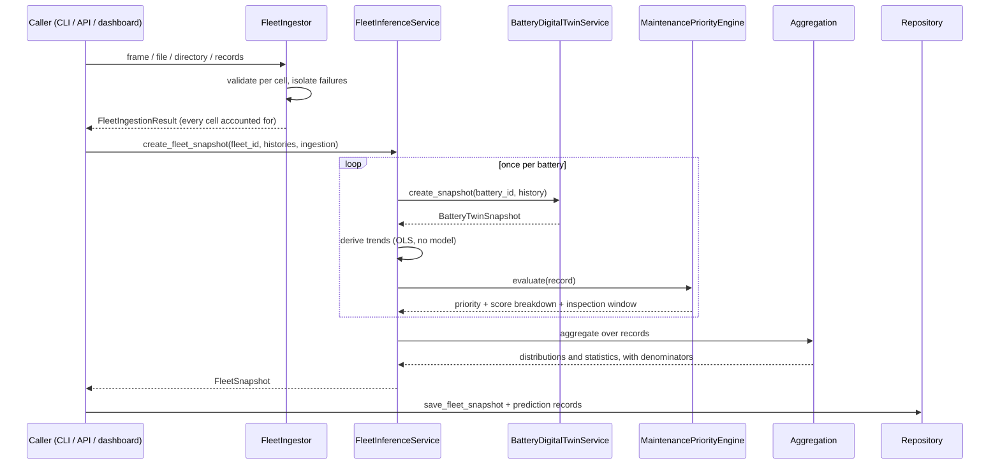

# Fleet architecture

How a fleet of cell histories becomes an ordered list of maintenance decisions,
and which module is responsible for each step.

---

## The pipeline

---

## Module responsibilities

### `fleet/ingestion.py`

Turns four input shapes into validated per-battery histories:

| Shape | Method | Used by |
| --- | --- | --- |
| Long-form frame with `battery_id` | `from_frame` | batch, demo |
| One tabular file | `from_file` | batch CLI |
| Directory of per-battery files | `from_directory` | batch CLI |
| Processed cycle table | `from_processed_cycles` | batch, dashboard |
| In-memory records | `from_records` | API |

Rejections and repairs are different things and are handled differently:

| Condition | Outcome | Why |
| --- | --- | --- |
| Duplicate `cycle_index` | **reject** | not repairable without guessing which row is real |
| Missing `cycle_index` / `capacity_ah` | **reject** | not a cycle record |
| No finite capacity | **reject** | nothing to derive health from |
| Fewer rows than `fleet.min_cycles_per_battery` | **reject** | cannot support a decision |
| More rows than `service.max_history_cycles` | **reject** | a request-size bound |
| Unordered cycles | **warn + sort** | sorting is a repair, not a guess |
| Large cycle gap | **warn** | trailing windows span a discontinuity |
| Missing capacity on some cycles | **warn** | the quality layer scores it |

Windows never cross a `battery_id`: each cell's history is a separate frame, so
no rolling mean, lag or slope can read another cell's past as this one's.

### `fleet/inference.py`

Orchestration only. Three properties it guarantees:

* **Single inference path.** It calls `BatteryDigitalTwinService`; it never loads
  a bundle. A test asserts zero bundle loads during a fleet run.
* **Failure isolation.** Each cell is scored inside its own try/except. A failure
  becomes a `FAILED` record carrying the exception type and message.
* **Deterministic output.** Results are indexed and re-sorted, so the worker
  count cannot change a snapshot's content or ordering.

Statuses drive every denominator downstream:

| Status | Meaning | Enters predicted aggregates? |
| --- | --- | --- |
| `success` | produced a RUL prediction | yes |
| `insufficient_data` | well-formed input, no prediction possible | no |
| `failed` | rejected at ingestion, or inference raised | no |

### `fleet/maintenance.py` — policy, not model

See `docs/MAINTENANCE_PRIORITY_ENGINE.md`. The engine reads model *outputs* and
deterministic trends, and applies configurable thresholds. It is separately
testable and every rule is exercised individually.

### `fleet/aggregation.py`

Every statistic carries its denominator, and measured and predicted quantities
use *different* denominators, because a cell can have a measured SOH and no
prediction.

### `fleet/analytics.py`

Trailing-window OLS trends over 20 cycles, and a duty-rate estimate from
timestamps. A missing trend returns `None`, never `0.0` — a flat trend and an
absent one are different facts, and a rule that conflates them stops firing
silently when a sensor drops out.

---

## Online versus batch

| | Online (`/v1/fleet/*`) | Batch (`run_fleet_batch`) |
| --- | --- | --- |
| Size | ≤ `fleet.max_batteries_per_request` (default 100) | ≤ `fleet.max_batteries_per_batch` (default 10 000) |
| Execution | synchronous, bounded | offline, resumable by re-running |
| Output | JSON response, battery records paged | persisted snapshot + CSV plans |
| Failure | partial success, HTTP 200 | partial success, exit 0 |
| Monitoring | data quality + drift only | full suite incl. delayed labels |

Exceeding the online limit returns **413** with a message naming the batch
command. A large fleet forced through one HTTP request is a timeout waiting to
happen, and the error says so rather than letting it happen.

---

## Concurrency

`fleet.max_concurrency` defaults to **1**. The estimators are already
BLAS-parallel, so extra threads mostly contend; more importantly, the twin holds
fitted artifacts whose thread-safety is inherited from scikit-learn rather than
guaranteed here. Raising it is supported and tested — results are re-ordered to
the input order, so a snapshot is identical either way.

---

## What is deliberately absent

* **No message broker.** Batch jobs are minutes long and scheduled. Kafka here
  would be infrastructure that exists to look production-grade.
* **No distributed execution.** A 10 000-cell fleet on one machine is minutes of
  CPU. Distributing it would add a failure mode per cell for no throughput.
* **No caching of predictions.** A snapshot is cheap to recompute and stale
  predictions in a maintenance decision are worse than a slow page.
* **No write-back to a battery-management system.** This platform is decision
  support; commanding a BMS is out of scope and stated as such in every payload.
