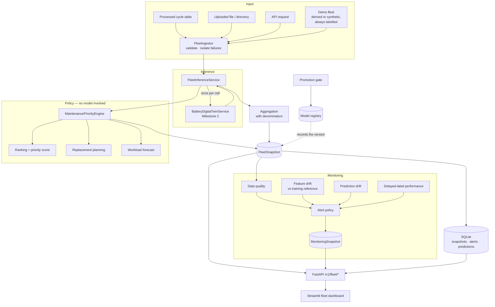

# Milestone 3 — Battery Fleet Intelligence & Production MLOps

Milestone 1 built a remaining-useful-life model. Milestone 2 wrapped it in a
digital twin that answers questions about **one cell**. Milestone 3 answers
questions about **a fleet**, and adds the machinery that makes running it
responsibly possible: monitoring, a model registry, a promotion gate,
persistence, containers and CI.

---

## What was added

| Capability | Where it lives | Entry point |
| --- | --- | --- |
| Fleet domain model | `src/battery_rul/fleet/domain.py` | `FleetSnapshot` |
| Fleet ingestion | `src/battery_rul/fleet/ingestion.py` | `FleetIngestor` |
| Batch inference | `src/battery_rul/fleet/inference.py` | `FleetInferenceService` |
| Maintenance priority | `src/battery_rul/fleet/maintenance.py` | `MaintenancePriorityEngine` |
| Replacement planning | `src/battery_rul/fleet/replacement.py` | `ReplacementPlanner` |
| Ranking / priority score | `src/battery_rul/fleet/ranking.py` | `compute_priority_score` |
| Aggregation | `src/battery_rul/fleet/aggregation.py` | `fleet_statistics` |
| Trends | `src/battery_rul/fleet/analytics.py` | `battery_trends` |
| Demo fleet | `src/battery_rul/fleet/demo.py` | `ingest_demo_fleet` |
| Data-quality monitoring | `src/battery_rul/monitoring/data_quality.py` | `summarise_fleet_data_quality` |
| Feature drift | `src/battery_rul/monitoring/drift.py` | `detect_feature_drift` |
| Prediction drift | `src/battery_rul/monitoring/prediction_drift.py` | `detect_prediction_drift` |
| Delayed-label performance | `src/battery_rul/monitoring/performance.py` | `evaluate_delayed_labels` |
| Alert policy | `src/battery_rul/monitoring/alerts.py` | `AlertPolicy` |
| Model registry | `src/battery_rul/registry/store.py` | `FileModelRegistry` |
| Promotion gate | `src/battery_rul/registry/promotion.py` | `PromotionGate` |
| Experiment tracking | `src/battery_rul/tracking/experiment.py` | `build_tracker` |
| Persistence | `src/battery_rul/persistence/sqlite.py` | `SQLiteRepository` |
| Observability | `src/battery_rul/observability/` | `METRICS`, `bind_context` |
| Fleet API | `src/battery_rul/api/fleet_routes.py` | `/v1/fleet/*`, `/v1/models`, `/v1/monitoring/latest` (15 new endpoints) |
| Fleet dashboard | `src/battery_rul/dashboard/fleet_app.py` | 14 pages |
| Pipelines | `src/battery_rul/pipelines/milestone_3.py` | 8 CLI commands |

Milestone 1 and Milestone 2 code is unchanged except for **one additive method**
(`BatteryDigitalTwinService.prepare_features`) and six **new** configuration
sections. No existing interface, schema version or response shape moved — a
regression test asserts each of those facts (`tests/test_milestone_3_regression.py`).

---

## The five questions this milestone answers

**Which batteries are most critical?**
`FleetInferenceService` scores every cell through the Milestone 2 twin, the
maintenance engine assigns a priority from configurable rules, and the ranking
layer orders them. Every ranking carries a score breakdown.

**Have the inputs or the model's behaviour changed?**
Feature drift compares the batch against a versioned reference fitted on the
training partition. Prediction drift compares the model's outputs against a
reference batch. They are reported separately, and neither is called model
degradation.

**Is the model still accurate?**
Only labelled outcomes can answer that, and prognostic labels arrive late. The
performance monitor joins predictions to outcomes when they appear and reports
`NO_LABELS` / `INSUFFICIENT_LABELS` honestly until they do.

**Which model made this decision?**
Every fleet record, snapshot and prediction record carries a model version; the
registry records which version is in PRODUCTION, who promoted it and when.

**What should be inspected, and when?**
The maintenance engine emits a priority, an action, an inspection window in
cycles, and — only when the history carries enough timestamps to measure a duty
rate — a calendar estimate.

---

## Architecture



---

## The layering rule

The one architectural constraint everything else follows from:

> **Battery-level inference has exactly one entry point.**

`FleetInferenceService` calls `BatteryDigitalTwinService.create_snapshot` once
per cell and never loads a model, builds a feature or applies a calibration
itself. A test asserts that scoring a fleet loads **zero** bundles
(`test_bundles_are_loaded_once_not_once_per_battery`), and another asserts the
fleet service holds the injected twin instance.

Three layers sit above it and none of them touch a model:

* **policy** (priority rules, replacement horizons) — deterministic, configurable,
  changeable without retraining;
* **aggregation** — statistics with explicit denominators;
* **monitoring** — observes inputs and outputs, and never modifies them.

---

## Commands

```bash
# One-off: build the drift reference from the training partition
python -m battery_rul.pipelines.build_reference --config configs/default.yaml

# Score a fleet and persist the snapshot, ranking and plans
python -m battery_rul.pipelines.run_fleet_batch --config configs/default.yaml \
    --fleet-id DEMO-FLEET-01 --source processed

# Data quality, drift, delayed-label performance and alerts
python -m battery_rul.pipelines.run_monitoring --config configs/default.yaml \
    --fleet-id DEMO-FLEET-01 --source processed

# Render the Markdown fleet report
python -m battery_rul.pipelines.generate_fleet_report --config configs/default.yaml \
    --fleet-id DEMO-FLEET-01

# Registry lifecycle
python -m battery_rul.pipelines.register_model --model-name battery-rul \
    --model-version 1.0.0 --bundle artifacts/rul --validation-status VALIDATED
python -m battery_rul.pipelines.evaluate_promotion --model-name battery-rul \
    --model-version 1.0.0 --unit-tests --contract-tests --smoke-test --leakage-check
python -m battery_rul.pipelines.promote_model --model-name battery-rul \
    --model-version 1.0.0 --by "$(git config user.name)" --dry-run
python -m battery_rul.pipelines.rollback_model --model-name battery-rul --by "operator"

# Serving
python -m battery_rul.api.app
streamlit run src/battery_rul/dashboard/fleet_app.py
```

Exit codes: `0` success, `1` the stage failed, `2` the stage ran and the
promotion gate returned REJECTED.

---

## What is production-*shaped* and what is production-*validated*

| Component | Status |
| --- | --- |
| Fleet inference, ranking, priority engine | Implemented and tested; **not** validated against real maintenance outcomes |
| Drift and data-quality monitoring | Implemented and tested on real and synthetic batches |
| Delayed-label performance monitoring | Implemented; exercised with fixture labels only — no real delayed labels exist for this cohort |
| Model registry, promotion gate, rollback | Implemented and tested; the gate genuinely rejects the current RUL bundle on interval coverage |
| Persistence (SQLite) | Implemented and tested; single-node |
| Docker images | Written; **not built in this environment** (no Docker daemon) — see `docs/DOCKER_DEPLOYMENT.md` |
| CI workflows | Written and YAML-validated; not executed on a runner from here |
| Authentication, multi-tenancy, secrets management | **Not implemented.** See `docs/SECURITY.md` |

Read `docs/MILESTONE_3_LIMITATIONS.md` before quoting anything here as a result.
