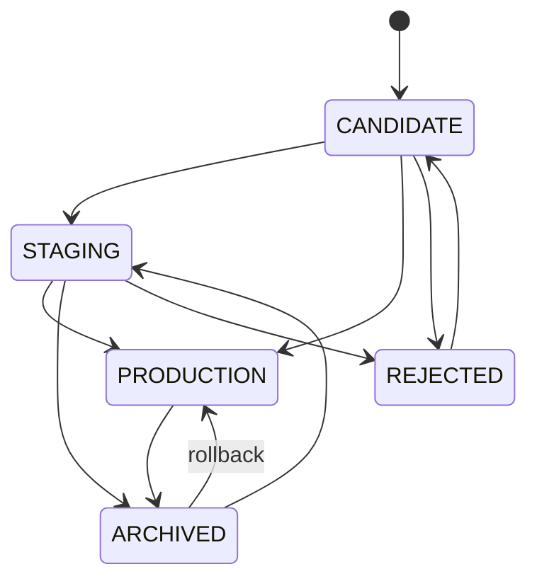

# Model registry

A registry answers one operational question a directory of pickles cannot:
**which model produced this decision, and who decided it should be live?**

---

## Why a JSON file rather than MLflow's Model Registry

MLflow's registry requires a tracking *server* with a database backend. For a
single-node prototype that is a service to run, secure and back up in order to
store what is, here, a list of forty-line records. Experiment tracking *does*
use MLflow when it is installed and selected (`docs/EXPERIMENT_TRACKING.md`);
the registry is a JSON document behind an interface narrow enough to swap.

`artifacts/registry/models.json`:

```json
{
  "schema_version": "3.0",
  "models": [
    {
      "model_name": "battery-rul",
      "model_version": "1.0.0",
      "stage": "CANDIDATE",
      "bundle_path": "artifacts/rul",
      "artifact_checksum": "3f9c…",
      "dataset_fingerprint": "53df6f08c6c8",
      "data_fingerprint": "efaf21bc3eede903",
      "feature_schema_fingerprint": "c7c0a875626d83e2",
      "n_features": 80,
      "task": "rul_regression",
      "validation_status": "VALIDATED",
      "created_at_utc": "2026-08-13T00:12:57+00:00",
      "promoted_at_utc": null,
      "promoted_by": null
    }
  ],
  "history": [{"action": "register", "model": "battery-rul:1.0.0", "…": "…"}]
}
```

---

## Stages



`PRODUCTION → REJECTED` is deliberately illegal. It would leave the fleet served
by something the registry says was refused; archive it first.

---

## Guarantees

**At most one PRODUCTION version per model family.** Enforced on write:
promoting a version auto-archives the previous one and records that in the
history. `production_model()` raises rather than guessing if it ever finds two.

**Checksums are verified, not trusted.** Every entry carries a SHA-256 over its
bundle files in a fixed order (`metadata.json`, `model.pkl`,
`preprocessing.pkl`, `calibration.pkl`, `uncertainty.pkl`), with absent optional
files hashed as their absence. Promotion re-verifies it and refuses on mismatch:
a registry entry pointing at a bundle that has since been overwritten is worse
than no registry.

**Bundle paths are relative to the project root.** A registry file must never
carry a developer's home directory into a commit; a test asserts it does not.

**Every transition is recorded** with who, when, why, and which versions were
auto-archived.

**Read-only deployments cannot modify it.** `deployment.read_only` raises before
any write.

---

## Commands

```bash
# Register a built bundle as a CANDIDATE
python -m battery_rul.pipelines.register_model \
    --model-name battery-rul --model-version 1.0.0 \
    --bundle artifacts/rul --validation-status VALIDATED \
    --notes "Milestone 2 RUL bundle"

# Evaluate the gate (never promotes; exit 2 on REJECTED)
python -m battery_rul.pipelines.evaluate_promotion \
    --model-name battery-rul --model-version 1.0.0 \
    --unit-tests --contract-tests --smoke-test --leakage-check

# Promote — dry run first
python -m battery_rul.pipelines.promote_model \
    --model-name battery-rul --model-version 1.0.0 --by "alice" --dry-run
python -m battery_rul.pipelines.promote_model \
    --model-name battery-rul --model-version 1.0.0 --by "alice" --reason "gate approved"

# Roll back to the previously live version
python -m battery_rul.pipelines.rollback_model --model-name battery-rul --by "alice" \
    --reason "1.1.0 regressed on interval coverage"
```

Over HTTP: `GET /v1/models` and `GET /v1/models/production` are read-only and
never publish a filesystem path. `POST /v1/admin/models/promote` and
`/rollback` exist but are **disabled by default** — see `docs/SECURITY.md`.

---

## Rollback

Rollback is a first-class operation, not "promote the old one again". It has to
work when the current production model is broken, and it has to pick the version
that was **actually live before** — the most recently archived entry that has a
`promoted_at_utc`, not simply the newest archive.

```
before:  1.0.0 ARCHIVED (promoted 10:00)   1.1.0 PRODUCTION (promoted 11:00)
rollback →
after:   1.0.0 PRODUCTION                  1.1.0 ARCHIVED
```

Both transitions are recorded with the reason. The single-production invariant
holds throughout, and a test asserts the restored version's artifact still
verifies against its checksum.

---

## Relationship to serving

The serving path loads bundles from the configured artifact directories; the
registry records *which version those artifacts are* and who approved them.
Fleet snapshots cite both: `model_metadata.active_model_version` from the
loaded bundle, and `registry_model_name` / `registry_stage` from the registry
when one is present.

When no model is at PRODUCTION, the dashboard says so and the API returns 404
with the command to promote one — the service keeps working, but the live model
is not *explicit*, and the platform says which of the two situations you are in.
