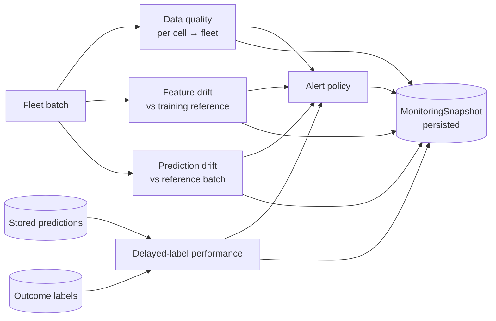

# Monitoring architecture

Four questions, kept apart on purpose.

| Question | Module | Can it tell you the model got worse? |
| --- | --- | --- |
| Is the **input** usable? | `monitoring/data_quality.py` | No — it is about sensors |
| Have the **inputs** moved away from training? | `monitoring/drift.py` | No |
| Has the **output distribution** moved? | `monitoring/prediction_drift.py` | No |
| Given labels, is the model still accurate? | `monitoring/performance.py` | **Yes** — and only this one |

Conflating them is how a team retrains a healthy model because a temperature
sensor failed, or ignores a genuinely degraded model because "drift is green".

---

## The diagnostic table

Read the first two columns together; the third is the action.

| Feature drift | Labelled performance | What it probably is | What to do |
| --- | --- | --- | --- |
| OK | HEALTHY | Nothing | Nothing |
| **Drifted** | HEALTHY | Population changed in a way the model handles (a fleet that aged) | Note it; consider refreshing the reference deliberately |
| OK | **DEGRADED** | The world changed without the inputs changing, or a label pipeline problem | Investigate labels first, then the model |
| **Drifted** | **DEGRADED** | Genuine covariate shift the model cannot handle | Candidate for retraining — with a human deciding |
| Drifted | NO_LABELS | Unknown | Wait for labels; do not retrain on drift alone |

The last row is the common case early in a deployment and the one that most
often triggers a premature retrain.

---

## A monitoring run

Order matters: the fleet is scored first, so every finding in the snapshot
refers to one identifiable batch of inputs.

---

## The reference distribution

Feature drift is a comparison and needs a fixed, versioned, inspectable other
side.

* Built by `python -m battery_rul.pipelines.build_reference`
* Fitted on the **training partition only** (`monitoring.reference_partition`);
  the final test partition is never read, because a reference fitted on it would
  fold the held-out result into the serving machinery
* Stored as **JSON**, never a pickle — a monitoring artifact is read by a
  long-running service, and a pickle is executable content
* Carries a content fingerprint that every drift report cites
* Subsampled deterministically when large, so a rebuild cannot change a verdict
  through a different random draw

Per feature it stores: count, missing rate, mean, standard deviation, min, max,
seven quantiles, quantile-derived bin edges and the reference bin frequencies —
everything PSI, KS, Wasserstein and JS need, as numbers.

---

## Statuses

Every surface reports one of four:

| Status | Meaning |
| --- | --- |
| `OK` | Checked, nothing found |
| `WARNING` | Checked, something crossed a warning threshold |
| `CRITICAL` | Checked, something crossed a critical threshold |
| `UNKNOWN` | **Could not check** — no reference, too few samples, no labels |

`UNKNOWN` is not a soft `OK`. A drift report over 12 rows and a drift report
over 12 000 rows that found nothing are different states, and a dashboard that
renders both green teaches an operator to trust an empty check.

---

## Monitoring snapshots

One run, one `MonitoringSnapshot`, persisted with:

* `snapshot_id`, `generated_at_utc`, `fleet_id`, `batch_id`
* `model_version` and `data_version` — a finding is only actionable next to the
  model that produced it
* the four summaries, each complete enough to act on
* `alerts` with their evidence and recommended human actions
* `overall_status` — the worst of the four, never an average
* `report_paths`, **relative** to the project root: an absolute path in a
  persisted document leaks a filesystem layout into every consumer

Stored via the repository abstraction (SQLite by default) and readable at
`GET /v1/monitoring/latest`.

---

## What monitoring never does

* **Retrain.** No threshold crossing triggers training. The cause might equally
  be a broken sensor, a changed duty cycle, or twenty labels from one unusual
  cell.
* **Promote or roll back a model.** That is an explicit human action through the
  registry CLI.
* **Page anyone.** External notification needs credentials and an on-call rota
  this repository does not have. `monitoring.alerts.external_notifications` is
  `False` and frozen; a notifier configured with placeholder values would look
  like coverage while providing none.
* **Modify inputs or predictions.** Monitoring observes.
