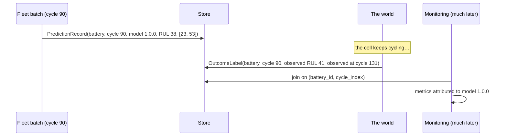

# Performance monitoring with delayed labels

The only monitoring signal that can tell you the model got worse — and the one
that arrives last.

---

## The delay is the design constraint

A prediction of "38 cycles remaining" made at cycle 90 can only be scored once
the cell has actually reached end of life. On the NASA cohort that is dozens of
cycles later; in a real fleet it can be months. Everything in this module is
built around that gap.



**Metrics are attributed to the model version that made the prediction**, not to
whatever is in production when the label lands. Skipping that is how a new model
inherits its predecessor's errors.

---

## The join

Inner join on `(battery_id, cycle_index)`.

* A prediction with no label is **not** a zero-error prediction.
* A label with no prediction is **not** a miss.
* Both are reflected in `label_coverage`, which is reported on every run.

---

## Statuses

| Status | When | Metrics published? |
| --- | --- | --- |
| `NO_LABELS` | no labels have been joined | none |
| `INSUFFICIENT_LABELS` | fewer than `min_labels` (default 20) | none |
| `HEALTHY` | labels present, no threshold crossed | yes |
| `WARNING` | a warning threshold crossed | yes |
| `DEGRADED` | a degraded threshold crossed, or PR-AUC below the floor | yes |

`NO_LABELS` early in a deployment is expected, not a failure, and the report
says so in its warnings. A MAE over a handful of rows is dominated by which
cells happened to finish first, which is why no metric is published below the
minimum.

---

## Metrics

**RUL** — MAE, RMSE, bias, plus MAE/RMSE/bias broken down by life stage
(0–20, 20–50, 50–100, 100+ observed cycles). Prognostic error is strongly
heteroscedastic — wide early in life, tight near end of life — so a single MAE
hides the regime that matters most.

**Prediction intervals** — empirical coverage of the intervals that were actually
issued, beside the nominal level, with mean width. The note attached says
production predictions are not exchangeable with the conformal calibration cells
in the way the nominal level assumes.

**SOH** — MAE, RMSE, bias, and the persistence baseline (SOH now as the forecast
of SOH at t+H) where the measurement is available.

**Risk** — PR-AUC, ROC-AUC, Brier score, calibration error, precision, recall.
When every joined label is the same class, ranking and calibration metrics are
**undefined** and reported as unavailable rather than as a perfect or a zero
score.

---

## Thresholds

`monitoring.performance`:

| Setting | Default | Meaning |
| --- | --- | --- |
| `min_labels` | 20 | below this, nothing is published |
| `rul_mae_thresholds` | (15, 30) cycles | warning, degraded |
| `soh_mae_thresholds` | (0.03, 0.06) | warning, degraded |
| `brier_thresholds` | (0.15, 0.25) | warning, degraded |
| `pr_auc_floor` | 0.50 | below this is degraded |
| `coverage_tolerance` | 0.05 | how far below nominal coverage may fall |

---

## These numbers are not the test-set numbers

Every report carries:

> Production monitoring metrics are computed on labels that became available
> after the prediction was made. They are not comparable with the Milestone 1
> and Milestone 2 held-out test metrics, which describe a different partition.

The test metrics describe a fixed partition of a laboratory dataset under a
chosen split. These describe whatever cells happened to be scored in production,
at whatever life stages they happened to be in. Putting them in the same table
would invite a comparison neither supports.

---

## Supplying labels

```python
from battery_rul.monitoring.performance import OutcomeLabel
from battery_rul.persistence import build_repository

repository = build_repository(cfg)
repository.save_outcome_labels([
    OutcomeLabel(
        battery_id="B0005",
        cycle_index=90,                 # the cycle the prediction was made at
        observed_at_cycle=131,          # when the outcome became known
        observed_rul=41.0,
        observed_soh=0.71,
        eol_within_horizon=True,        # did EOL actually occur within the horizon
        label_source="teardown_report", # provenance of the label
    )
])
```

`observed_at_cycle − cycle_index` is the evaluation delay, summarised on every
report. A metric computed on labels that arrived instantly is measuring a
different problem from one whose labels took forty cycles.

---

## No automatic retraining

A crossed threshold produces an **alert for a human**. The cause might equally be

* a broken sensor,
* a fleet that changed duty cycle,
* twenty labels arriving from one unusual cell, or
* a genuinely degraded model.

Only the last one is fixed by retraining, and only a person with the sensor logs
and the duty schedule in front of them can tell which it is. The alert's
`recommended_human_action` says exactly that.

---

## Current state in this repository

No real delayed labels exist for the NASA cohort in a production sense: the
cells' end-of-life cycles are already known and are the training labels. The
delayed-label pathway is therefore exercised with **fixture labels** in
`tests/test_monitoring_performance.py` and
`tests/test_milestone_3_regression.py::test_delayed_labels_turn_into_a_performance_report`,
and real monitoring runs here report `NO_LABELS`. That is the honest state, and
`docs/MILESTONE_3_LIMITATIONS.md` records it.
